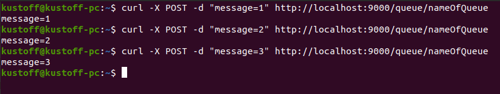
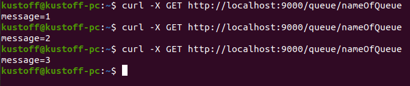
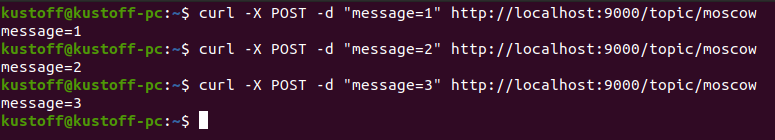
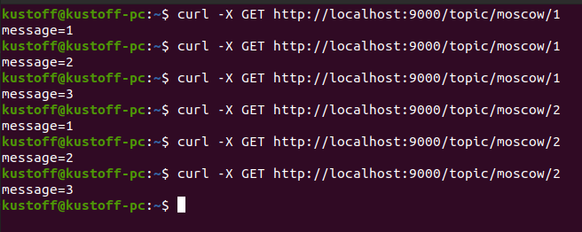

# Application Async Queue

## About project
#### Desc
An application that implements the functionality of an asynchronous queue.
At startup, the ServerSocket starts and waits for client requests.
Clients can be of two types: senders (publisher) and recipients (subscriber).
The cURL utility is used as a client `https://curl.se/download.html`
Two modes of work: queue and topic

#### Technology
> JDK14, Maven, Junit, Sockets, Java Concurrency, Java IO

## Init
0. Download repository files
1. Build the project: `mvn clean install`
2. Copy the resulting *target/Wget.jar* file to your server folder
3. The application will be available on the port specified in the *PoohServer* file

## Working with Docker
1. Create a directory on the server and copy the repository files
2. Go to the created directory (project root) and build the application with the command: `mvn install`
3. Build the docker image of the application with the command: `docker build -t wget .`
5. Run image: `docker run -d -p 9000:9000 wget`

## How use
**queue** mode

The sender sends a request to add data, indicating the queue and the value of an arbitrary parameter.
The message is placed at the end of the queue. If there is no queue in the service, then you need to create a new one and put a message in it:

`curl -X POST -d "message=1" http://localhost:9000/queue/nameOfQueue`

`curl -X POST -d "message=2" http://localhost:9000/queue/nameOfQueue`

`curl -X POST -d "message=3" http://localhost:9000/queue/nameOfQueue`

The recipient sends a request to receive data indicating the queue.
The message is taken from the head of the queue and removed.

`curl -X GET http://localhost:9000/queue/nameOfQueue`

**topic** mode

In the *ru/job4j/pooh/TopicService* file, set the topic and ID of subscribers (for example: topic - "moscow", id - 1, 2).
The sender sends a request to add data indicating the topic, and the parameter value.
The message is saving at the end of each individual recipient queue.
If the topic is not in the service, then the data is ignoring.

`curl -X POST -d "message=1" http://localhost:9000/topic/moscow`

`curl -X POST -d "message=2" http://localhost:9000/topic/moscow`

`curl -X POST -d "message=3" http://localhost:9000/topic/moscow`

The recipient sends a request to receive data indicating the topic. If there is no topic, a new one is created.
If the topic is present, then the message is taken from the head of the recipient's individual queue and removed.

## Contact
Kutiavin Vladimir

telegram: @kutiavinvladimir
